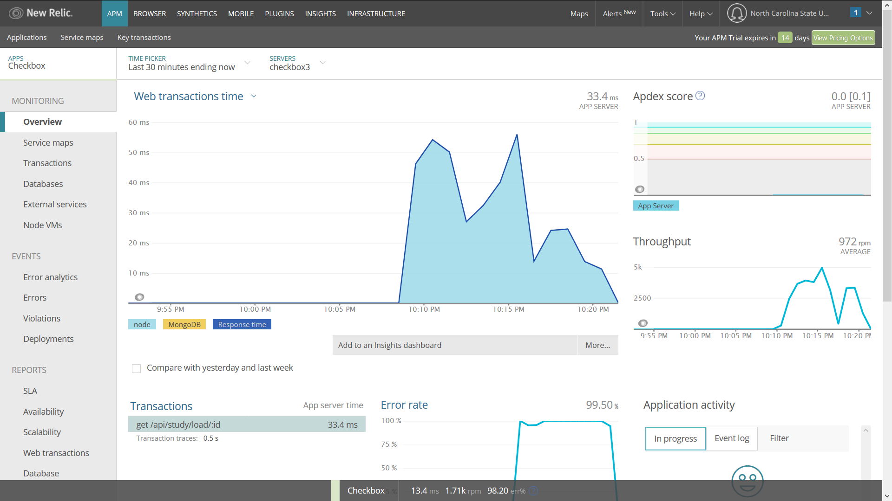

# Special Milestone  
   
### New Relic Integration   
For monitoring purposes we used the [New Relic](https://newrelic.com/) application, which we integrated into the code for checkbox.io. This gave the New Relic software access of the data, traffic etc in the deployed checkbox application. Using this, the various statistics of the application were calculated on a 5 minutes interval. Also many servers on which checkbox was deployed can be monitored simultaneously. The data can be monitored on the new relic website by the authorized user. A screenshot of the monitoring:  

   
### A Chaos Experiment  
In this milestone we created a Chaos experiment to test the resilience of the `checkbox.io` application. The checkbox.io application runs on a Node.js server and uses MongoDB for its database.  
   
When deployed, the application may be accessed by many people at the same time. This may lead to many unexpected problems in the application's services when it is live. This is an undesirable thing and hence we must be prepared for it before hand. To analyze the application in such high traffic situations and also in attacks that use such conditions, we created a [DDOS monkey](https://github.ncsu.edu/ppatel16/DevOpsKnights/blob/chaos/chaos/ddos-monkey.js).   
This monkey sends randomly high number of requests to the server of the checkbox.io application which leads to increase in the latent respose time of the application and at times no response at all. This monkey was designed in node.js, using the `ddos-stress` library. The ip address and port number on which to carry out the attack is specified and the number of simultaneous requests to be sent to that port are decided randomly. The changes in the functioning are tracked on the New Relic application.
    
The mongoDB's functionality may be dependent on how much data is present in the database. To check for what happens when the database is filled with lots of data, we generated a [Mongo monkey](https://github.ncsu.edu/ppatel16/DevOpsKnights/blob/chaos/files/monkeys/mongo-monkey.js).      
This monkey generates random data using `faker` to be inserted into the database. The number of such data entries is also decided as some random but big number. The changes in the functioning are tracked on the New Relic application.   
   
There can be many problems in the functioning of the database which may arise due to various reasons. To have an idea as to what random chaos does, we created a [Random monkey](https://github.ncsu.edu/ppatel16/DevOpsKnights/blob/chaos/random-monkey.js).   
This monkey takes all the monkeys that we learnt in the [Chaos Engineering](https://github.com/CSC-DevOps/Chaos) workshop randomly selects one of them and runs them on the application. Again, the changes in the functioning are tracked on the New Relic application.  
   

